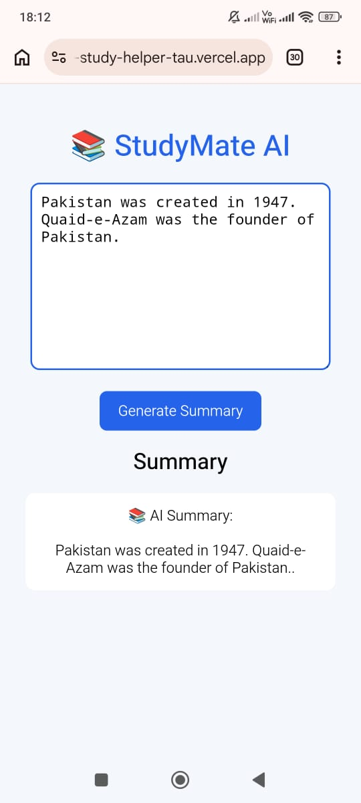

# AI Study Helper

## App Name
AI Study Helper

## What it does
AI Study Helper is a web app that helps students quickly summarize their study notes. Users can paste their notes and get a short summary for fast revision.

## Problem it solves
Many students have long notes that take time to read. This app makes revision easier by creating a short summary.

## Live URL
https://ai-study-helper-tau.vercel.app

## Features
- Paste study notes
- Generate AI summary
- Simple and easy-to-use interface
- Fast revision support

## AI Feature
The app uses AI-inspired text summarization to generate a short summary from the notes entered by the user.

## Tools Used
- HTML
- CSS
- JavaScript
- GitHub
- Vercel

## Screenshots

### 1. Home Page

### 2. Summary Generated

### 3. GitHub Repository

## How to Run
1. Open the live URL.
2. Paste your study notes.
3. Click the **Summarize** button.
4. Read the generated summary.

## GitHub Repository
https://github.com/sanchiahuja1234/Ai-study-helper
